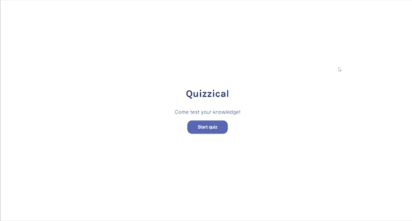

# Quizzical

 

[DEMO](#)

Piccolo gioco quiz che ho fatto con React. Alla partenza del gioco vengono mostrate 5 domande a risposta multipla, in base al numero di domande corrette si ottiene un punteggio finale che può andare da 0 a 5.

Questo è stato il mio primo passaggio dalla teoria alla pratica per quanto riguarda React: ho avuto non pochi problemi e ho dovuto sbattere la testa un po' di volte prima di riuscire a far funzionare certe cose, ma tutto sommato mi sento grato di aver trovato questi ostacoli e mi ritengo soddisfatto di come è uscito fuori il progetto!

Hai dei feedback? Scrivimi pure su [LinkedIn](https://www.linkedin.com/in/francesco-vicario/) :v:

## Dettagli tecnici

All'avvio si presenta la prima schermata, creata con il component `Preface`.

Al click del `button`, viene cambiato lo state `start` e di conseguenza si passa al component `Quiz`: alla partenza, con l'utilizzo di `useEffect`, viene effettuata la chiamata alla [Trivia API](https://opentdb.com/api_config.php), i cui dati in risposta vengono prima organizzati in oggetti e poi inseriti nello state `questions`.

Ognuna delle risposte di ogni domanda ha una funzione `onClick` che permette di selezionarla o deselezionarla come risposta: inizialmente viene creato un nuovo array, dopodiché viene controllato tutto `questions`: se l'id della risposta e della domanda coincidono viene controllato tutto `answer`, e se i testi della risposta coincidono `isSelected` viene convertito di valore, altrimenti viene impostato su `false`. Il tutto viene poi inserito nell'array creato e sostituito al vecchio valore di `questions`.

Al fondo della schermata c'è un `button` che cliccato imposterà lo stato `endGame` su `true`: ad ogni risposta verrà aggiunta una classe, che cambia in base ai valori delle key `isSelected` e `isCorrect`. In aggiunta a ciò verrà mostrato un messaggio al fondo della pagina con il risultato finale, ottenuto tramite la funzione `setFinalScore`: essa controlla che ci siano risposte con entrambe le key `isSelected` e `isCorrect` con valore `true`, e nel caso aggiunge 1 a una variabile appositamente creata.

Premuto ancora una volta il sopracitato `button`, parte la funzione `newGame`, che riporta il valore di `endGame` a `false`, imposta il valore di `questions` a un'array vuoto e aggiunge 1 allo state `count`, usato come dependency di `useEffect`. Così facendo verranno renderizzate nuove domande e verrà iniziata una nuova partita.

## Getting Started with Create React App

This project was bootstrapped with [Create React App](https://github.com/facebook/create-react-app).

### Available Scripts

In the project directory, you can run:

#### `npm start`

Runs the app in the development mode.\
Open [http://localhost:3000](http://localhost:3000) to view it in your browser.

The page will reload when you make changes.\
You may also see any lint errors in the console.

#### `npm test`

Launches the test runner in the interactive watch mode.\
See the section about [running tests](https://facebook.github.io/create-react-app/docs/running-tests) for more information.

#### `npm run build`

Builds the app for production to the `build` folder.\
It correctly bundles React in production mode and optimizes the build for the best performance.

The build is minified and the filenames include the hashes.\
Your app is ready to be deployed!

See the section about [deployment](https://facebook.github.io/create-react-app/docs/deployment) for more information.

#### `npm run eject`

**Note: this is a one-way operation. Once you `eject`, you can't go back!**

If you aren't satisfied with the build tool and configuration choices, you can `eject` at any time. This command will remove the single build dependency from your project.

Instead, it will copy all the configuration files and the transitive dependencies (webpack, Babel, ESLint, etc) right into your project so you have full control over them. All of the commands except `eject` will still work, but they will point to the copied scripts so you can tweak them. At this point you're on your own.

You don't have to ever use `eject`. The curated feature set is suitable for small and middle deployments, and you shouldn't feel obligated to use this feature. However we understand that this tool wouldn't be useful if you couldn't customize it when you are ready for it.

### Learn More

You can learn more in the [Create React App documentation](https://facebook.github.io/create-react-app/docs/getting-started).

To learn React, check out the [React documentation](https://reactjs.org/).
